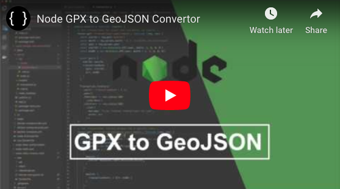

# GPX to GeoJSON Convertor

This handy application helps to convert .gpx files to .geojson quickly and easily.

## Tutorial Available

[YouTube: GPX to GeoJSON Convertor](https://www.youtube.com/watch?v=YwRGml8_3DU)

[](https://www.youtube.com/watch?v=YwRGml8_3DU "GPX to GeoJSON Convertor with Node")

### Technologies:
- [Mapbox GeoJson](https://github.com/mapbox/togeojson)
- [NodeJS](https://nodejs.org)

## Getting Started

### Converting

To use this application to convert a .gpx file to .geojson we can simply run the following command in your terminal:

Required Parameters:

- `--in`: The relative path to the input .gpx file
- `--out`: The relative path to the desired output .geojson file, including filename and .geojson extension

_Example:_
```sh
node convert.js --in=input.gpx --out=output.geojson
```
